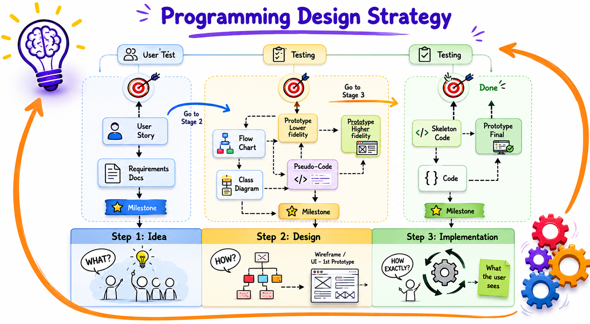
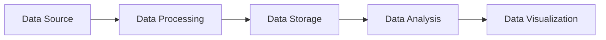
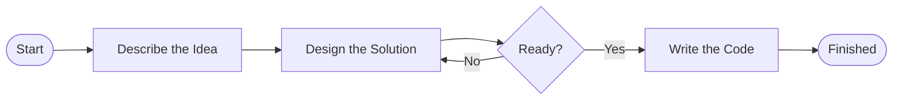

# Program Design

In programming, we want to go from an idea (an informal thought) to code (a
precise formal language). Conducting this process is what programming really is
about, writing the commands is only the last bit. For a small program, writing
code might be sufficient. In a large one, we need tools that support us. Here,
we will call them __artifacts__. We can distinguish three types of artifacts:

+ __Idea__ tools that help us to write down the idea and communicate it with
  non-programmers and programmers
+ __Design__ - formalize the idea but keep it independent of the technology
  (e.g. languages or libraries)
+ __Coding Strategies__ – things that directly result in code



The diagram above shows how software development progresses from an initial
idea, through design and planning, and finally into implementation. The process
is iterative, meaning that testing and feedback may require revisiting earlier
stages before producing the final solution.

---
### Class Diagram

A class diagram focuses on data structure. It shows the main classes of a
program, their attributes, methods, and relationships.

Class diagrams are mostly independent of behavior and programming language. In
Python, they may also include important modules. In databases, an
Entity-Relationship diagram fulfills a similar purpose.

---
### Data Flow Diagram

Like a flow chart but more focusing on where the data goes. Useful to describe a
pipeline-like architecture


---
### Flowchart

Drawing containing fine-grained sequence of steps including branches and loops.
Helps to discuss algorithms and processes but is agnostic of program structure,
data structure and programming language.



---
### Prototype

A quick and simple implementation created to test an idea before investing time
and resources into building the final solution.

A prototype is used to validate a design and reduce risk by answering specific
questions early in the development process.

A prototype usually focuses on answering only one or two questions, such as:

* Will users understand the interface?
* Does the solution solve the original problem?
* Is the chosen approach technically possible?
* Is the workflow easy to use?
* Is the performance acceptable?

---
### Pseudocode

A semi-formal description of an algorithm or process used to guide the
implementation.

Pseudocode is more detailed than many other design tools because it may describe
variables and how they change during execution. It focuses on the behavior of
the solution while remaining independent of program structure and programming
language.

Pseudocode helps developers think through the logic before writing actual code. For more information read the 
[Introduction to Pseudocode](03_intro_to_pseudocode.md). 

---
### Requirements Document

A detailed description of what users need (**User Requirements**), what the
system must do (**System Requirements**), and which constraints must be
considered (**Nonfunctional Requirements**, such as programming language,
performance, or operating system support).

Requirements are usually created before the design phase. In large projects,
developing requirements may take months and produce hundreds of pages of
documentation.

Requirements can later be transformed into tasks or GitHub issues.

Example requirements for Tic-Tac-Toe:

1. **User Requirements**

   * 1.1 As a user, I want a clear game interface that displays the
     Tic-Tac-Toe grid.
   * 1.2 As a user, I want to make moves by selecting a row and column.
   * 1.3 As a user, I want immediate feedback when making a move.
   * 1.4 As a user, I want to be notified when I win.
   * 1.5 As a user, I want to be notified when the game ends in a draw.

2. **System Requirements**

   * 2.1 The Tic-Tac-Toe board shall be implemented as a nested list.
   * 2.2 Players shall be represented using `X` and `O`.

3. **Nonfunctional Requirements**

   * 3.1 The implementation shall be written in Python.
   * 3.2 The program shall run on a machine with at least 2 GB of memory.
   * 3.3 The program shall support Windows, macOS, and Linux.

---
### Skeleton Code

Skeleton code is an initial version of a program that defines the overall
structure while leaving the implementation details unfinished.

Classes, functions, and modules are created, but the bodies are left empty:

```python
def print_board():
    pass

def check_win():
    pass

...

```

Skeleton code helps developers evaluate whether the planned program structure is
reasonable and feasible before implementing the full solution.

Ideally, skeleton code should already run successfully, even if it does not yet
provide the final functionality.

---
### User Story

A short description of a feature written from the user's point of view.

User Stories are commonly used in Agile development to describe what users want
to achieve without specifying technical implementation details. A User Story
should be short and focused on a single goal.

Example User Stories for Tic-Tac-Toe:

> As a player, I want to play a game of Tic-Tac-Toe against another player so
> that I can enjoy a simple and interactive game experience.

> As a player, I want to receive clear feedback after each move so that I always
> understand the current state of the game.

> As a player, I want to be notified when the game ends so that I know whether
> I won, lost, or the game ended in a draw.

## Further Reading & Resources
- [**Class Diagram**](https://www.tutorialspoint.com/uml/uml_class_diagram.htm)
- [**Flowchart**](https://www.programiz.com/article/flowchart-programming)
- [**Python Skeleton Code**](https://coderivers.org/blog/python-skeleton/)
- [**User Stories**](https://teachingagile.com/agile/user-story/what-is-user-story)